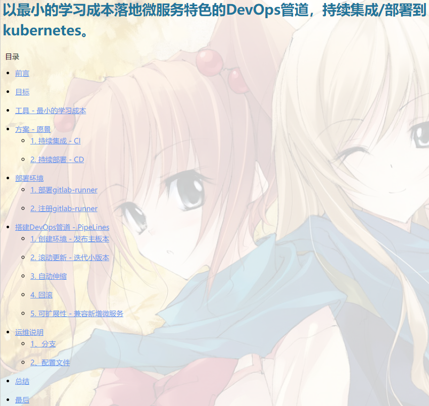

# MicroService.AutoDevOpsPipeLines
Build a mature and stable automated DevOps pipeline with minimum learning cost, and continuously integrate/deploy AspnetCore micro-services to kubernetes.

以最小的学习成本搭建一套成熟稳定的自动化DevOps管道，持续集成/部署微服务(AspnetCore)到kubernetes。

详情请访问博客地址：[以最小的学习成本落地微服务特色的DevOps管道，持续集成/部署到kubernetes。](https://www.cnblogs.com/justmine/p/10193965.html)

下面的测试几乎涵盖了结合k8s管理应用生命周期的所有流程(部署、伸缩、回滚、发布)：

